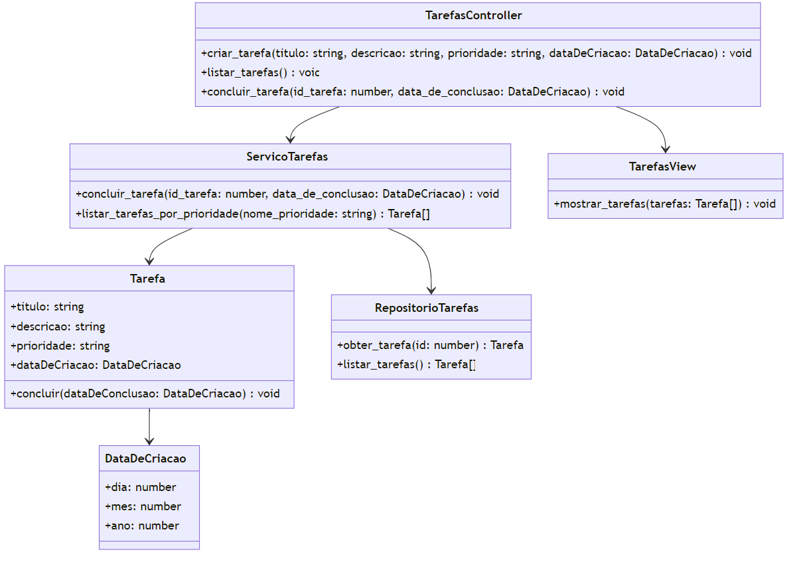

# Sistema de Gerenciamento de Tarefas

1. Objetivo do Sistema
O Sistema de Gerenciamento de Tarefas tem como objetivo permitir a criação, edição, listagem, conclusão e deleção de tarefas. Cada tarefa possui informações como título, descrição, prioridade, estado (concluída ou pendente) e data de criação.

2. Arquitetura do Sistema
O sistema segue a arquitetura MVC (Model-View-Controller) e aplica os conceitos de Domain-Driven Design (DDD).

* Model: Representa as entidades do domínio, como Tarefa e DataDeCriacao.
* View: Responsável por apresentar as informações ao usuário.
* Controller: Gerencia a comunicação entre a View e o Model, processando as requisições do usuário e atualizando a View.

3. Funcionalidades do Sistema
* Criação de Tarefas: Permite a criação de novas tarefas com título, descrição, prioridade e data de criação.
* Listagem de Tarefas: Lista todas as tarefas criadas.
* Conclusão de Tarefas: Permite marcar uma tarefa como concluída.
* Edição de Tarefas: Permite a edição do título e descrição de uma tarefa existente.
* Deleção de Tarefas: Permite a remoção de uma tarefa.
* Filtragem de Tarefas: Permite listar tarefas por estado, prioridade e categoria.

* Aqui está o diagrama de classes que representa o funcionamento do sistema:

